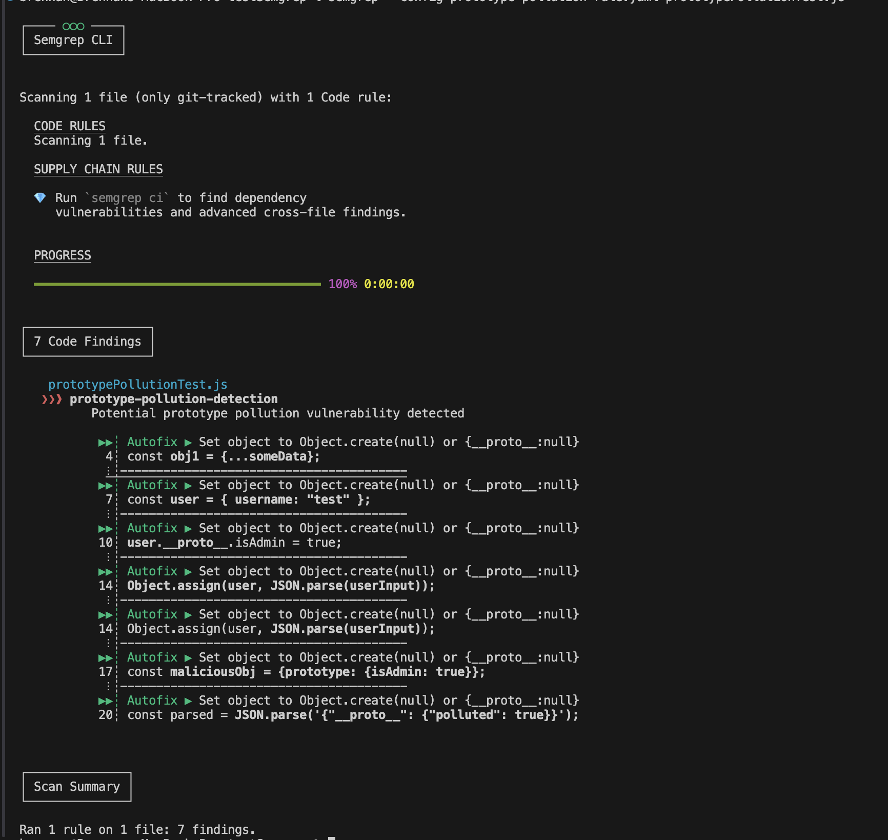

# Semgrep Security Rules Testing Guide

A comprehensive guide for setting up and testing Semgrep security rules, focusing on prototype pollution detection.

## Quick Start

### Repository Setup

```bash
# Create and initialize repository
gh repo create "testSemgrep" --public
git init
git remote add origin <your-github-repo-url>
git branch -M main

# Create project structure
touch prototypePollutionTest.js
touch prototype-pollution-rule.yaml
touch README.md

# Stage changes
git add .

# Commit changes
git commit -m "Your Comments"

# Status of version
git status

# Push to GitHub
git push -u origin

# Testing the rule against test file
# Test specific rule
semgrep --config prototype-pollution-rule.yaml prototypePollutionTest.js
```


